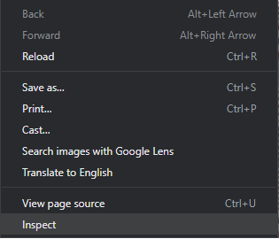
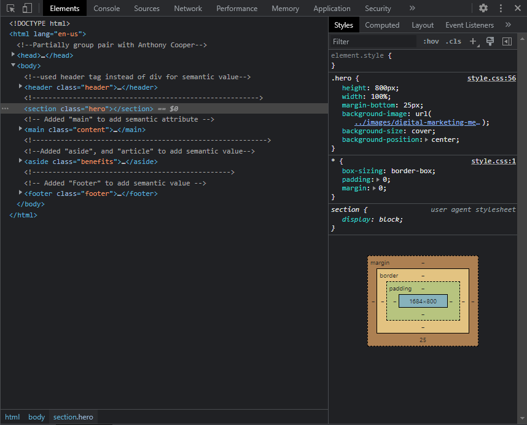
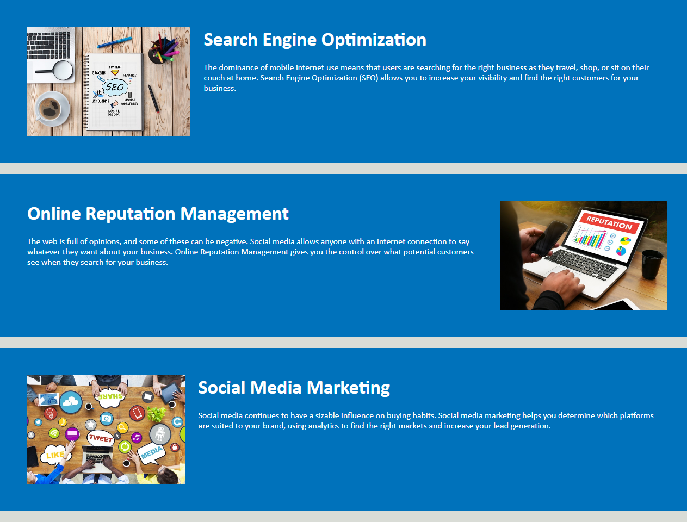
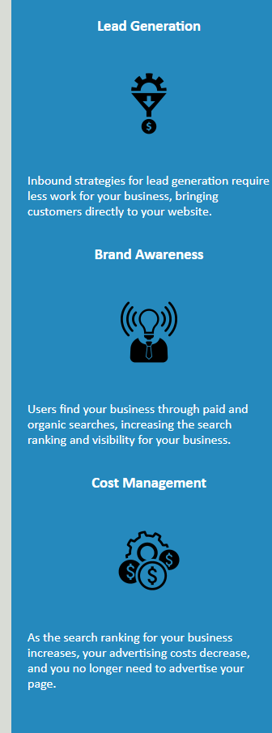

# seo-refactor

Link to my [Horiseon refactor project](https://github.com/SamsonKnightz/seo-refactor).

Check out my other [projects](https://github.com/SamsonKnightz) on github.
## Description
With the given webpage from a marketing agency, the codebase now follows accessibility standards. This is created to optimize search engines. If you open up the source code by right clicking on the webpage with mouse cursor and then left click [Inspect](#Inspect). You will find the structured semantic HTML elememnts. You will also find elements that follow a logical structure of styling and position. You could also view the alt attributes in the image elements. All images has been resized, due to webpage loading time. I have also added heading attributes that fall in sequential order. The title element was added to add a title pertaining to the webpage.

## Table Of Contents
+ [How to Inspect](#Inspect)

+ [Changes](#Changes)

+ [Visuals](#Visuals)

+ [Resources](#Resources)

## How to Inspect

+ After right clicking on webpage, left click inspect to inspect webpage.

+ On the right side of your browser will display the source code for HTML on the left, and on the right it  displays CSS code.

## Changes

+ "Search Engine Optimization" link was not working, added "class" attribute to HTML code.

+ Resized images for h2, and changed "div" codes to add semantic HTML elements. 

+ Resized images for h3, and consolidated CSS styling.  

## Visual

+ Full view of webpage.

## Resources

+ [Make A README](https://www.makeareadme.com/)

+ [Adam-P's Markdown Cheat Sheet](https://github.com/adam-p/markdown-here/wiki/Markdown-Cheatsheet#images)

+ [Monadical Anontomy of HTML and CSS](https://monadical.com/posts/anatomy-of-html-css-js.html)

+ [HTML Accessibility](https://blog.hubspot.com/website/html-accessibility)

+ [Greengeeks HTML tags for SEO](https://www.greengeeks.com/blog/html-tags-for-seo/)

+ [MOZ's begginners guid to SEO](https://moz.com/beginners-guide-to-seo/why-search-engine-marketing-is-necessary)